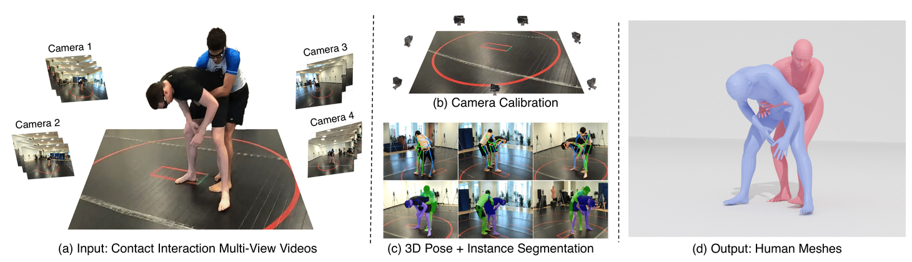

<div align="center">

<h2><font size="10">Harmony4D: A Video Dataset for In-The-Wild Close Human Interactions</font></h2>

<b><font size="4">NeuRIPS 2024</font></b>

[Rawal Khirodkar](https://github.com/rawalkhirodkar)\*, [Jyun-Ting Song](https://jyuntins.github.io/)\*, [Jinkun Cao](https://www.jinkuncao.com/), [Zhengyi Luo](https://www.zhengyiluo.com/), [Kris Kitani](https://kriskitani.github.io/)
 
[Carnegie Mellon University](https://www.cmu.edu/)

<sup>*</sup>equal contribution

<p><a href="https://jyuntins.github.io/harmony4d" style="background-color:#2ecc71; color:white; padding:10px; text-decoration:none; border-radius:5px;">Project Page</a></p> 

<a href="https://huggingface.co/datasets/Jyun-Ting/Harmony4D/tree/main" style="background-color:#2ecc71; color:white; padding:10px; text-decoration:none; border-radius:5px;">Data</a>
</div>


Understanding how humans interact with each other is key to building realistic
multi-human virtual reality systems. This area remains relatively unexplored
due to the lack of large-scale datasets. Recent datasets focusing on this issue
mainly consist of activities captured entirely in controlled indoor environments
with choreographed actions, significantly affecting their diversity. To address
this, we introduce Harmony4D, a multi-view video dataset for human-human
interaction featuring in-the-wild activities such as wrestling, dancing, MMA, and
more. We use a flexible multi-view capture system to record these dynamic
activities and provide annotations for human detection, tracking, 2D/3D pose
estimation, and mesh recovery for closely interacting subjects. We propose a
novel markerless algorithm to track 3D human poses in severe occlusion and
close interaction to obtain our annotations with minimal manual intervention.
Harmony4D consists of 1.66 million images and 3.32 million human instances
from more than 20 synchronized cameras with 208 video sequences spanning
diverse environments and 24 unique subjects. We rigorously evaluate existing stateof-the-art methods for mesh recovery and highlight their significant limitations
in modeling close interaction scenarios. Additionally, we fine-tune a pre-trained
HMR2.0 model on Harmony4D and demonstrate an improved performance of
54.8% PVE in scenes with severe occlusion and contact. 
“Harmony—a cohesive alignment of human behaviors.”

<div align="center">
“Harmony—a cohesive alignment of human behaviors.”
</div>

## Overview

<div style="text-align:center;">
    
</div>




## Get Started
- [🛠️Installation](assets/INSTALL.md)
- [📘Download Data](assets/DOWNLOAD.md)
- [👀Visualization](assets/VISUALIZE.md)

## BibTeX & Citation

```
@misc{2410.20294,
Author = {Rawal Khirodkar and Jyun-Ting Song and Jinkun Cao and Zhengyi Luo and Kris Kitani},
Title = {Harmony4D: A Video Dataset for In-The-Wild Close Human Interactions},
Year = {2024},
Eprint = {arXiv:2410.20294},
}
```

## Acknowledgement
[Aria Toolkit](https://github.com/facebookresearch/projectaria_tools), [COLMAP](https://github.com/colmap/colmap), [mmpose](https://github.com/open-mmlab/mmpose/tree/main), [mmhuman3D](https://github.com/open-mmlab/mmhuman3d), [CLIFF](https://github.com/haofanwang/CLIFF), [timm](https://github.com/rwightman/pytorch-image-models), [detectron2](https://github.com/facebookresearch/detectron2), [mmcv](https://github.com/open-mmlab/mmcv), [mmdet](https://github.com/open-mmlab/mmdetection), [mmtrack](https://github.com/open-mmlab/mmtracking).


## Contact
- For help and issues associated with Harmony4D, or reporting a bug, please open a [GitHub Issue](https://github.com/jyuntins/harmony4d).
